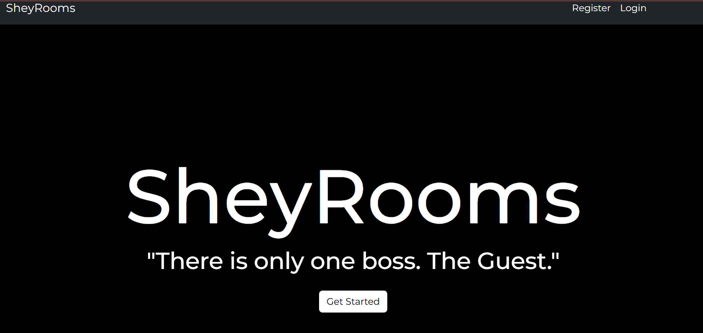
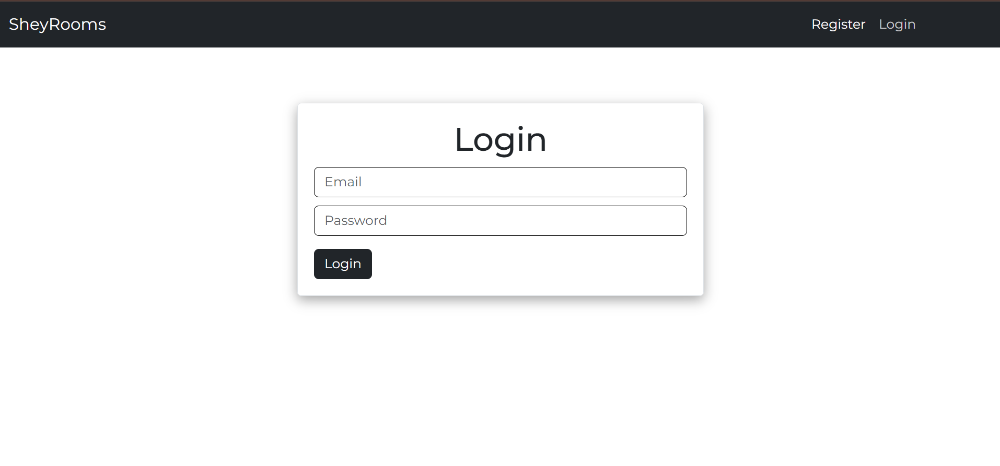
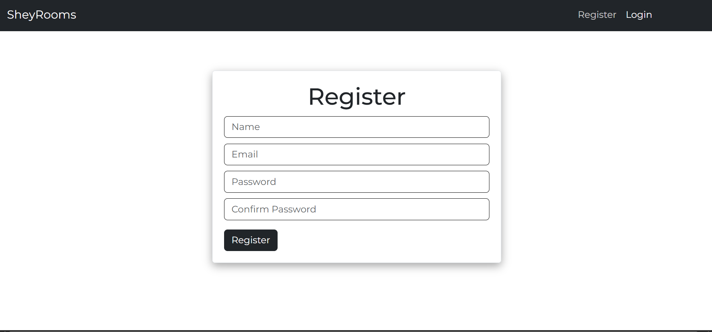
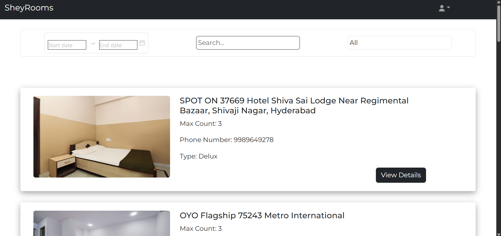
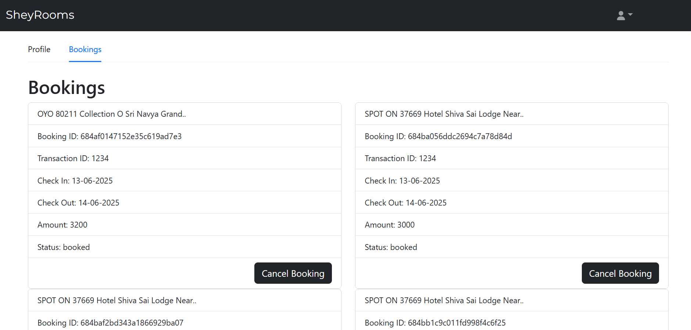
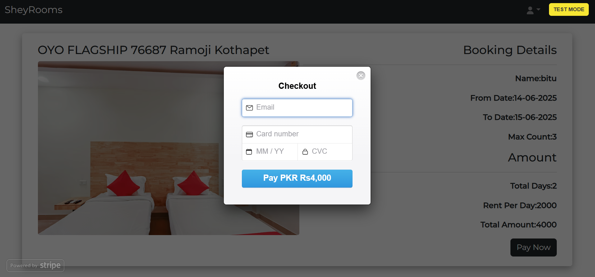
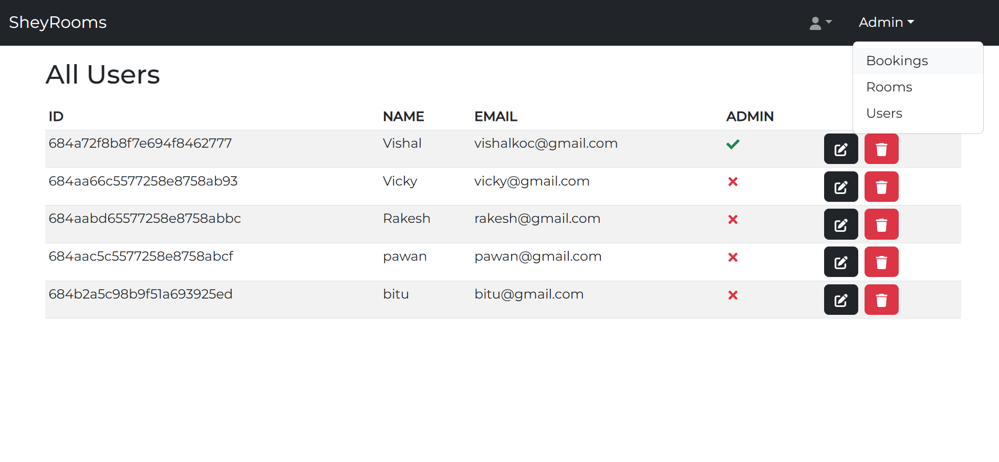

# 🏨 SheyRooms - Hotel Booking & Recommendation Platform

**SheyRooms** is a full-stack hotel booking web application where users can browse, search, and book hotel rooms. It includes Stripe payments, admin panel, and real-time booking tracking.

---

## 📁 Project Structure

SHEYROO/
├── client/ # React Frontend
│ ├── src/
│ ├── public/
│ └── .env # Frontend environment (API URL)
│
├── models/ # MongoDB Schemas
├── routes/ # Express API routes
├── db.js # MongoDB connection setup
├── server.js # Express app entry point
├── .env # Backend environment (DB URI, Stripe keys)

<<<<<<< HEAD
=======

---
>>>>>>> ac0a186e744323837221dc1a680d83e6e18a5e4e

## 🚀 Tech Stack

### 🖥️ Frontend (React)
- React + Bootstrap + Ant Design
- React Router DOM
- Axios for API calls
- Stripe Checkout for payment
- React Toastify for alerts

### 🔙 Backend (Node.js + Express)
- Express.js REST APIs
- MongoDB with Mongoose
- Stripe for secure payment handling
- JWT (if extended)

---

## 💻 How to Run Locally

### 1️⃣ Clone the Repository
```bash
git clone https://github.com/vishalkoc2016/iconcile_assignment.git
cd iconcile_assignment

2️⃣ Install Backend Dependencies
bash
npm install

3️⃣ Create .env File in Root
ini
<<<<<<< HEAD
=======

>>>>>>> ac0a186e744323837221dc1a680d83e6e18a5e4e
MONGO_URI=your_mongodb_connection_string
PORT=5000
STRIPE_SECRET_KEY=your_stripe_secret_key

4️⃣ Start the Backend
bash
node server.js
# or
npx nodemon server.js

5️⃣ Setup and Run Frontend
bash
cd client
npm install
Create .env in client/ folder:
ini
<<<<<<< HEAD

=======
>>>>>>> ac0a186e744323837221dc1a680d83e6e18a5e4e
REACT_APP_API_URL=http://localhost:5000
Start React App:

bash
<<<<<<< HEAD

=======
>>>>>>> ac0a186e744323837221dc1a680d83e6e18a5e4e
npm start
Frontend: http://localhost:3000
Backend: http://localhost:5000

🌐 Deployment Guide (Render)
✅ Frontend (Static Site on Render)
Click "New → Static Site"

Select GitHub Repo

Set:

Root Directory: client

Build Command: npm run build

Publish Directory: build

Add Environment Variable:

ini
<<<<<<< HEAD

=======
>>>>>>> ac0a186e744323837221dc1a680d83e6e18a5e4e
REACT_APP_API_URL=https://your-backend-url.onrender.com
✅ Backend (Web Service on Render)
Click "New → Web Service"

Select same repo or setup backend-only

Set Start Command:

nginx

node server.js
Add environment variables from backend .env file

🔥 Features
🔍 Search & Filter Rooms

🏨 View Room Details

👥 User Booking Flow

💳 Stripe Payment Integration

👮 Admin Panel

📦 MongoDB Storage

📸 Screenshots
## 📸 Project Screenshots

### 🏠 Landing Page


### 🔐 Login Screen


### 📝 Register Screen


### 🏨 Homepage


### 📅 Booking Screen


### 💳 Payment Screen


### ⚙️ Admin Panel



🙏 Acknowledgments
This project is inspired by YouTube MERN stack tutorials, customized and extended by Vishal Kumar.

👤 Author
Vishal Kumar
📫 GitHub: @vishalkoc2016
💼 LinkedIn: https://www.linkedin.com/in/vishalkoc2016/

Feel free to connect and collaborate!
